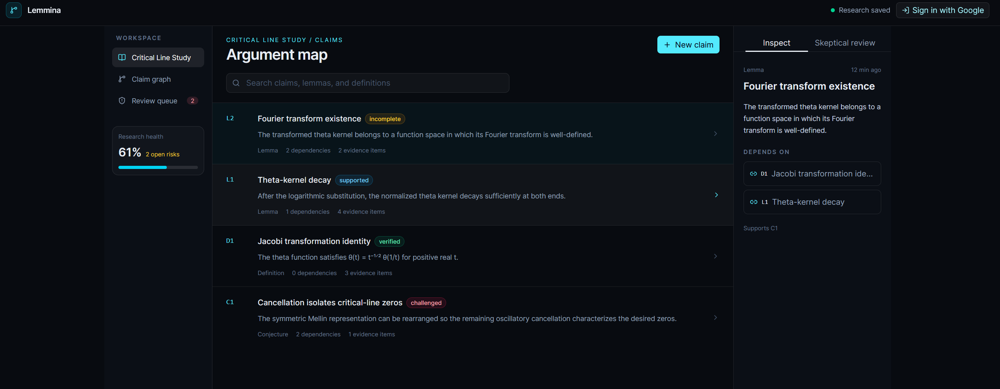

# Lemmina

A simple solution being built into a scalable mathematical research engine tool for investigating solutions to complex problems.



## Development

Install dependencies and start the auto-reloading development server:

```bash
npm install
npm run dev:watch
```

## Firebase Authentication

1. Create or open a Firebase project in the Firebase Console.
2. Add a Web app under Project settings and copy its configuration values.
3. Enable **Authentication** and the **Google** provider.
4. Add `localhost` under Authentication > Settings > Authorized domains.
5. Copy `.env.example` to `.env.local` and fill in the `VITE_FIREBASE_*` values.

The app currently provides Google sign-in and sign-out through Firebase Auth. Firebase web configuration values are public client settings; do not put server credentials or service-account keys in `.env.local` or client code.

## Firebase App Hosting

The app uses standard Next.js and Firestore for Firebase App Hosting. The existing `VITE_FIREBASE_*` names in `.env.local` are mapped into the Next.js client bundle by `next.config.ts`.

1. Ensure the Firebase project uses the Blaze plan.
2. Create a Firestore database in the Firebase Console.
3. Run `firebase login` and `firebase init apphosting`.
4. Select the existing Firebase project, create or select an App Hosting backend, and use the repository root as the app root.
5. Copy the contents of `.env.local` into the backend's **Environment variables** settings so the values are available during build and runtime.
6. Deploy with `firebase deploy`.

The local production check is `npm run build`. App Hosting deploys the Next.js server and the `/api/claims` route; claims are stored in the Firestore `claims` collection.


