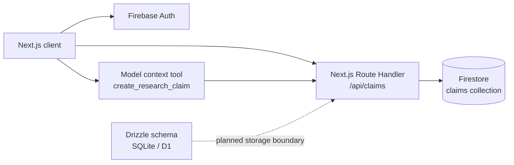

# Lemmina

Lemmina is a research workspace for turning difficult mathematical arguments into explicit, reviewable structures. Instead of keeping a proof in a document, it models claims, dependencies, evidence, and unresolved risks so a researcher can inspect how an argument is supported and where it is still weak.

The current product is a focused vertical slice: a claim browser, dependency inspection, skeptical review, Google authentication, and Firestore-backed persistence. The surrounding schema and deployment files show the direction toward a portable research system rather than hiding the work behind a mock demo.


## The problem

Long technical investigations fail in ways that ordinary note-taking tools do not make visible:

- A conclusion can look polished while depending on an unproved lemma.
- Evidence, assumptions, and definitions become difficult to distinguish as the argument grows.
- A reviewer needs to challenge a claim without losing the context that motivated it.
- Research state needs to be searchable and persistent, not trapped in a single session or file.

Lemmina treats an argument as a navigable graph. Each claim has a precise statement, a status, supporting evidence count, dependencies, and a recorded risk. That gives a researcher a compact answer to three questions: what do we believe, why do we believe it, and what should be checked next?

## What is implemented

- Searchable claim list for lemmas, definitions, claims, and conjectures.
- Detail inspection for a selected claim and its dependencies.
- Responsive layout with a mobile navigation mode and a larger inspection pane on desktop.

### Implementations which are Underway

- Reverse dependency visibility, showing which claims a selected item supports.
- Skeptical review checks for supporting claims, evidence, and formal review status.
- One-click challenge recording for claims that need independent justification.
- New claim creation from the UI or the registered `create_research_claim` model-context tool.
- Google sign-in and sign-out through Firebase Authentication.
- Loading and persistence through `GET` and `POST /api/claims`.

## Architecture



### Frontend/backend boundaries

The client owns interaction state: filtering, selected claim, modal visibility, optimistic claim creation, and review notices. It renders a seeded workspace so the interface remains useful before a backend is configured.

The route handler owns the persistence boundary. It accepts JSON, normalizes and validates the claim payload, limits text sizes, applies defaults, and writes a document to Firestore. The validation logic lives in `lib/claim-validation.ts` so it can be tested without booting Next.js or connecting to Firebase.

Firebase Auth is currently a client-side identity experience. The claims route is not yet enforcing Firebase ID tokens server-side; that is a known security limitation and a roadmap item.

## Database design

The active production path stores one document per claim in the Firestore `claims` collection:

| Field | Purpose |
| --- | --- |
| `id` | Stable claim identifier, such as `L1` or `C1` |
| `title` | Short human-readable label, capped at 160 characters |
| `statement` | Precise claim text, capped at 4,000 characters |
| `status` | `incomplete`, `supported`, `verified`, or `challenged` |
| `kind` | Claim classification, such as `Lemma` or `Conjecture` |
| `risk` | Current unresolved concern |
| `evidence` | Count of attached evidence items |
| `dependencies` | IDs of prerequisite claims |
| `createdAt`, `updatedAt` | ISO timestamps used for ordering and display |

The repository also contains a normalized SQLite/D1 design in `db/schema.ts`: `claims` plus a `claim_dependencies` join table with foreign keys, cascade deletion, and a unique dependency pair index. Drizzle migrations are generated under `drizzle/`. This schema is intentionally documented as groundwork; the current route uses Firestore and does not silently claim D1 parity.

## Technical decisions

- **Next.js App Router:** keeps the interactive workspace and API route in one deployable application.
- **Firebase:** provides a low-friction authentication and hosted document store for the first vertical slice.
- **Explicit claim validation:** keeps API input rules small, deterministic, and independently testable.
- **Firestore documents first:** fits the current flexible research metadata while the relational D1 model is evaluated for graph-heavy queries.
- **Drizzle schema as a migration path:** preserves a relational option for dependency traversal, constraints, and portable local/edge storage.
- **Small UI primitives:** the `components/ui` layer keeps interaction patterns consistent without coupling domain logic to visual components.

## Local setup

### Requirements

- Node.js `22.13` or newer
- npm
- A Firebase project for authentication and persistence (optional for viewing the seeded workspace)

Install dependencies and start the development server:

```bash
npm install
npm run dev
```

Open `http://localhost:3000`.

### Environment variables

Create `.env.local` from `.env.example` and provide the Firebase web configuration:

```dotenv
VITE_FIREBASE_API_KEY=...
VITE_FIREBASE_AUTH_DOMAIN=...
VITE_FIREBASE_PROJECT_ID=...
VITE_FIREBASE_STORAGE_BUCKET=...
VITE_FIREBASE_MESSAGING_SENDER_ID=...
VITE_FIREBASE_APP_ID=...
```

In Firebase, enable Google under Authentication, add `localhost` to the authorized domains, and create a Firestore database. These are public client configuration values. Never place service-account credentials or server secrets in `.env.local` or browser code.

## Commands

| Command | Purpose |
| --- | --- |
| `npm run dev` | Start the Next.js development server |
| `npm run lint` | Run ESLint across the repository |
| `npm test` | Run the claims payload contract tests with Vitest |
| `npm run build` | Verify a production Next.js build |
| `npm run start` | Serve the production build locally |
| `npm run db:generate` | Generate Drizzle migrations from the D1 schema |

## Deployment

Lemmina is configured for Firebase App Hosting. The deployment path is:

1. Ensure the Firebase project is on the Blaze plan and has Firestore enabled.
2. Run `firebase login` and `firebase init apphosting` from the repository root.
3. Select the existing project and create or select an App Hosting backend.
4. Add the `VITE_FIREBASE_*` values to the backend environment variables.
5. Run `npm run build` locally, then deploy with `firebase deploy`.

The deployed Next.js app serves the workspace and `/api/claims`; the route reads and writes the Firestore `claims` collection.

## Quality checks

The repository includes a GitHub Actions workflow that runs on pushes and pull requests. It installs the locked dependency tree, runs the claims contract tests, lints the code, and verifies a production build. The current tests focus on the highest-value boundary that can be tested without external services: required fields, status validation, defaults, length limits, and numeric evidence normalization.

## Current limitations

- The API does not yet verify Firebase ID tokens or scope claims to a signed-in user.
- Claims can be written to Firestore, but evidence is currently represented by a count rather than a first-class evidence model.
- The UI displays dependency links but does not yet provide a dedicated graph visualization or cycle detection.
- The seeded claims are in-memory fallback data, so the initial experience is not a complete multi-user workspace model.
- Firestore is the active store; the Drizzle/D1 schema is not yet wired into the route.
- There is no conflict resolution or audit history for concurrent edits.

## Roadmap

1. Add server-side Firebase token verification and per-user/workspace authorization.
2. Promote evidence, citations, and review events into first-class collections/tables.
3. Add dependency graph visualization, cycle detection, and impact analysis.
4. Add edit and delete workflows with optimistic updates and audit history.
5. Evaluate Firestore versus D1 for graph traversal and introduce a repository interface around storage.
6. Add end-to-end browser coverage for sign-in, claim creation, persistence failure, and skeptical review.
7. Add import/export for Markdown, JSON, and citation metadata.

## Project structure

```text
app/                 Next.js page, layout, and API route
components/          Auth components and reusable UI primitives
db/                  Drizzle SQLite/D1 schema and adapter
drizzle/             Generated database migrations
lib/                 Firebase clients and claim validation
assets/              Product screenshots
scripts/              Reproducible install and build helpers
```

Lemmina is deliberately small enough to understand end to end, but structured around the boundaries that matter in a real application: interaction state, a validated API contract, persistence, authentication, migrations, and automated checks.


